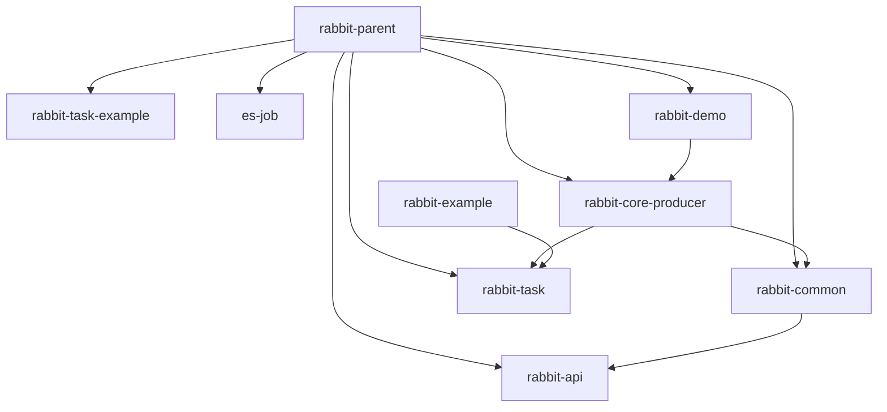

[Back to Home](../README_en.md)

## Project Overview
### Project Basic Information
- **Name:** rabbit-parent
- **GroupId (Maven):** com.itihub.base.rabbit
- **ArtifactId (Maven):** rabbit-parent
- **Version:** 1.0-SNAPSHOT
- **Main Programming Language:** Java

## Prerequisites
- **JDK Version:** 1.8 (explicitly specified through Maven's `<java.version>1.8</java.version>` property)
- **Build Tool Version:** Maven (identified through the `pom.xml` file structure and `<modelVersion>4.0.0</modelVersion>` tag)
- **Network Connection Middleware Dependencies:**
  - **RabbitMQ:** Through `spring-boot-starter-amqp` dependency (version managed by Spring Boot 2.2.4.RELEASE)
  - **MySQL:** Through `mysql-connector-java` dependency (version managed by Spring Boot 2.2.4.RELEASE)
  - **Elastic-Job:** 
    - `elastic-job-lite-core` 2.1.5
    - `elastic-job-lite-spring` 2.1.5
  - **Druid Connection Pool:** 1.0.24 (specified through the `<druid.version>` property)

## Build Guide
### Maven Build
- Build Commands:
    - Clean build: `mvn clean`
    - Compile project: `mvn compile`
    - Package project: `mvn package`
    - Install to local repository: `mvn install`
    - Deploy project: `mvn deploy`
- Build Process: 
    - Maven's build process mainly includes the following phases:
        1. **Clean**: Delete previously generated build files.
        2. **Validate**: Validate if the project is correct and all necessary information is available.
        3. **Compile**: Compile the project's source code.
        4. **Test**: Run tests using an appropriate unit testing framework.
        5. **Package**: Package the compiled code into a distributable format (such as JAR, WAR).
        6. **Verify**: Check the results of integration tests to ensure quality.
        7. **Install**: Install the package to the local repository for use as a dependency in other projects.
        8. **Deploy**: Copy the final package to a remote repository for use by other developers and projects.
- Packaging Directory: 
    - Packaged files are typically located in the `target/` directory:
        - Main module's JAR/WAR file: `target/<artifactId>-<version>.jar` or `target/<artifactId>-<version>.war`.
        - Test reports: `target/surefire-reports/`.
        - Generated source code and documentation (if configured with relevant plugins): `target/generated-sources/` and `target/site/`.
    - For multi-module projects (such as `rabbit-parent`), each sub-module generates its corresponding build output in its respective `target/` directory.

## Dependency Management
### Main Dependencies
- **Spring Boot Starter Parent**: Provides default configuration and dependency management for Spring Boot projects, version `2.2.4.RELEASE`.
- **Lombok**: Used to simplify Java code (such as automatically generating getter/setter), version `1.18.10`, scope is `provided`.
- **Guava**: Google's core library, provides collections, caching, and other utilities, version `${guava.version}` (actually `20.0`).
- **Apache Commons Lang3**: Provides string, array, and other utility classes, version `${commons-lang3.version}` (actually `3.9`).
- **Fastjson**: Alibaba's JSON processing library, version `${fastjson.version}` (actually `1.2.62`).
- **Elastic-Job**: Distributed task scheduling framework, version `2.1.5` (direct dependency, not managed through properties).
- **Spring Boot Starters**: 
  - `spring-boot-starter-web` (Web support)
  - `spring-boot-starter-test` (Testing support)
  - `spring-boot-starter-amqp` (RabbitMQ support)
  - `spring-boot-starter-jdbc` (JDBC support)
- **MyBatis Spring Boot Starter**: MyBatis integration, version `1.3.2`.
- **Druid**: Alibaba's database connection pool, version `${druid.version}` (actually `1.0.24`).

### Adding/Modifying Dependencies
- **Maven:** Add or modify `<dependency>` elements in the `<dependencies>` tag of the `pom.xml` file. For example:
  ```xml
  <dependency>
      <groupId>org.springframework.boot</groupId>
      <artifactId>spring-boot-starter-web</artifactId>
  </dependency>
  ```

### Dependency Version Management
- **Maven (`<dependencyManagement>`):** 
  - The parent project (`rabbit-parent`) uses `<dependencyManagement>` to uniformly manage dependency versions for sub-modules, avoiding conflicts.
  - Versions are centrally defined through properties (such as `${guava.version}`), making maintenance easier.
  - Sub-modules inherit dependency management from the parent project, eliminating the need to repeatedly specify versions (such as `commons-lang3` not explicitly declaring its version in sub-modules).
  - Exceptions: Some dependencies (such as `elastic-job-lite-core`) directly specify versions in sub-modules, bypassing parent project management.

## Module Dependency Diagram



## Project Structure

```
rabbit-parent/
├── rabbit-demo/                # Demo module (standard naming)
│   ├── src/
│   │   ├── main/
│   │   │   ├── java/com/itihub/rabbit/demo/  # Demo application entry
│   │   │   └── resources/                   # Application configuration
│   │   └── test/                            # Unit tests
├── rabbit-task/               # Scheduled task module (with ElasticJob annotations)
│   ├── src/
│   │   ├── main/
│   │   │   ├── java/com/itihub/rabbit/task/  # Task parsing and auto-configuration
│   │   │   └── resources/META-INF/           # Spring auto-configuration
├── rabbit-core-producer/      # Core message production module
│   ├── src/
│   │   ├── main/
│   │   │   ├── java/com/itihub/rabbit/producer/  # Message storage/retry/routing logic
│   │   │   └── resources/                        # Database scripts and configuration
├── rabbit-api/                # Message service interface definitions
│   ├── src/
│   │   ├── main/
│   │   │   └── java/com/itihub/rabbit/api/  # Message types/callback interfaces
├── rabbit-task-example/       # Task module examples (demonstration usage)
│   ├── src/
│   │   ├── main/
│   │   │   ├── java/com/itihub/rabbit/task/example/  # Example task implementation
│   │   │   └── resources/                            # Example configuration
├── es-job/                    # ElasticJob implementation module
│   ├── src/
│   │   ├── main/
│   │   │   ├── java/com/itihub/esjob/  # Task configuration and listeners
│   │   │   └── resources/              # Task property configuration
├── rabbit-common/             # Common utilities module
│   ├── src/
│   │   ├── main/
│   │   │   └── java/com/itihub/rabbit/common/  # Serialization/type conversion utilities
├── scripts/                   # Operations scripts (database/container)
│   ├── docker/                # RabbitMQ container configuration
│   └── db/migration/          # Database migration scripts
├── .git/                      # Version control directory
├── Architecture.png           # Architecture diagram
├── pom.xml                    # Maven parent POM
└── README.md                  # Project documentation
```

Naming Convention: Uses lowercase hyphen-style (such as rabbit-core-producer), sub-packages use Java standard com.itihub prefix
Layered Structure: Modular design, core functionality (producer/api) separated from extension functionality (task/es-job), common provides basic capabilities
Extension Design: Supports scheduled task extensions through independent task/es-job modules, scripts directory provides infrastructure configuration capabilities